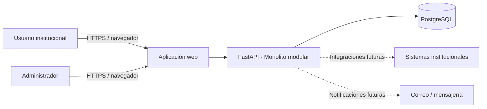
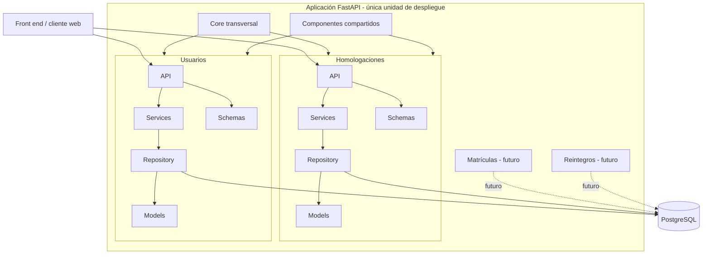
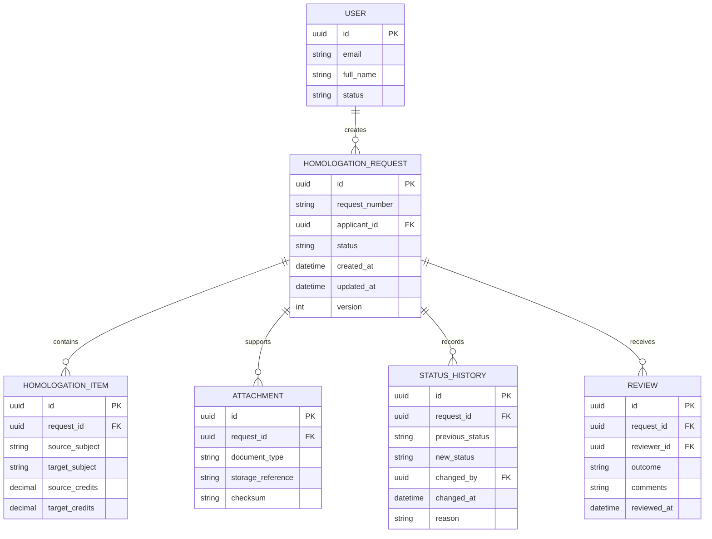
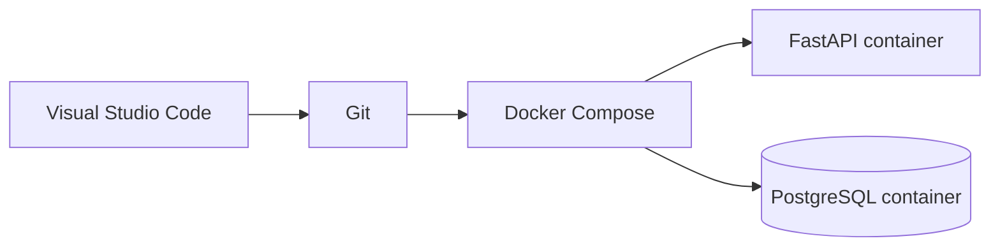
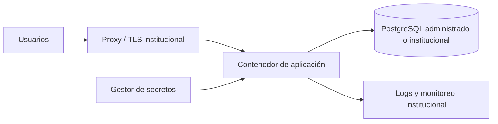
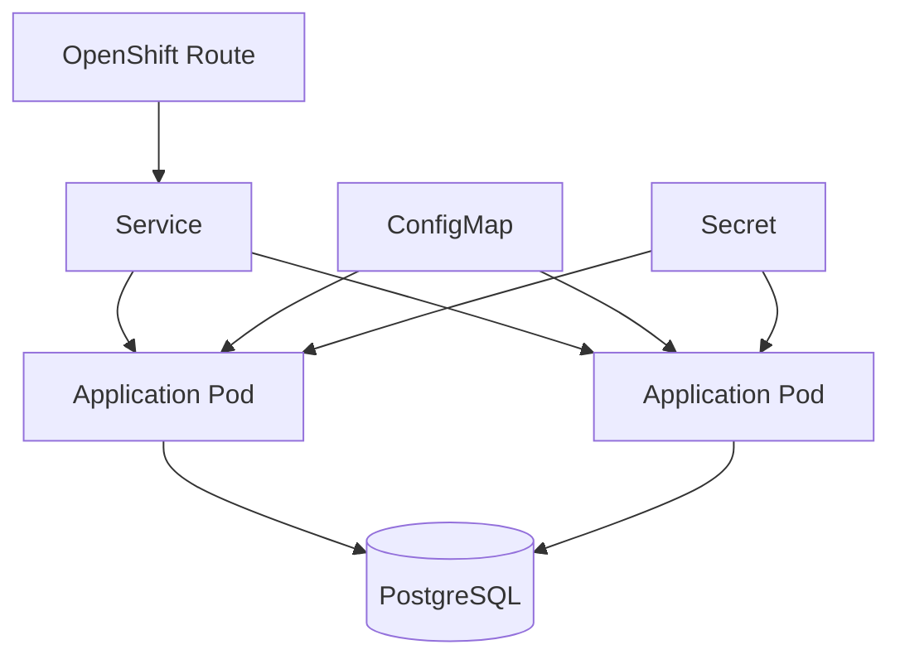

# Spec-Driven Document de Arquitectura

## 0. Cómo usar este documento

Este archivo es la **fuente de verdad técnica** para construir el proyecto mediante *vibecoding* con un agente de IA. El agente debe:

1. Leer este documento antes de crear o modificar código.
2. Implementar únicamente requisitos marcados como `APROBADO` o `BASE`.
3. Tratar los elementos `PROPUESTO` como decisiones sujetas a validación humana.
4. No inventar reglas del proceso de homologación que estén marcadas como `PENDIENTE`.
5. Trabajar en incrementos pequeños, verificables y reversibles.
6. Mantener trazabilidad entre requisito, código, prueba y commit.
7. Registrar cualquier desviación arquitectónica mediante un ADR en `docs/adr/`.

### Convenciones de estado

| Estado | Significado |
|---|---|
| `BASE` | Definido explícitamente en el documento de arquitectura suministrado. |
| `APROBADO` | Decisión validada por el equipo y habilitada para implementación. |
| `PROPUESTO` | Diseño recomendado para completar la especificación; requiere validación. |
| `PENDIENTE` | Información de negocio o técnica aún no suministrada. El agente no debe asumirla. |
| `FUERA_MVP` | No debe desarrollarse en el primer MVP, aunque la arquitectura debe permitir su incorporación futura. |

---

# 1. Visión del producto

## 1.1 Propósito

`BASE` Definir e implementar una arquitectura de software y una arquitectura de desarrollo que permitan:

- Construir el MVP del proceso universitario de homologaciones.
- Conservar la simplicidad operativa de una única aplicación durante el MVP.
- Organizar el código por procesos institucionales independientes.
- Incorporar progresivamente nuevos procesos universitarios.
- Evolucionar hacia una plataforma institucional de automatización sin reorganizar completamente el proyecto.

## 1.2 Resultado esperado del MVP

`PROPUESTO` Una aplicación web ejecutable inicialmente en entorno local, accesible desde navegador, con:

- Backend API desarrollado con FastAPI.
- Persistencia en PostgreSQL mediante SQLAlchemy.
- Módulo funcional de homologaciones.
- Módulo base de usuarios y control de acceso.
- Trazabilidad técnica de solicitudes y cambios.
- Entorno reproducible mediante Docker Compose.
- Documentación automática de API mediante OpenAPI/Swagger.

> La interfaz funcional, los actores, los estados, los documentos requeridos y las reglas de decisión del proceso de homologaciones permanecen `PENDIENTE` hasta contar con la especificación funcional institucional.

## 1.3 Alcance por fases

| Fase | Alcance | Estado |
|---|---|---|
| Fase 0 | Esqueleto técnico, contenedores, conexión a PostgreSQL, health checks y estructura modular. | `APROBADO` |
| Fase 1 | MVP del proceso de homologaciones. | `BASE` |
| Fase 2 | Incorporación del módulo de matrículas. | `FUERA_MVP` |
| Fase 3 | Incorporación del módulo de reintegros. | `FUERA_MVP` |
| Fase 4 | Evolución de infraestructura hacia servidor institucional. | `BASE` |
| Fase 5 | Escalabilidad sobre Red Hat OpenShift, si el crecimiento lo requiere. | `BASE` |

## 1.4 Fuera de alcance del primer incremento

- Microservicios independientes.
- Kubernetes u OpenShift para desarrollo local.
- Integración directa con sistemas institucionales no especificados.
- Motor BPM externo.
- Aplicación móvil nativa.
- Analítica avanzada o inteligencia artificial para decidir homologaciones.
- Automatización de matrículas y reintegros.
- Reglas de negocio inventadas por el agente de IA.

## 1.5 Punto de entrada de la aplicación

El backend contará con un único punto de entrada denominado **`main.py`**, responsable de inicializar la aplicación FastAPI, registrar los routers de cada módulo y cargar la configuración global.

Este archivo no deberá contener lógica de negocio ni acceso directo a la base de datos; dichas responsabilidades pertenecerán a los módulos funcionales correspondientes.


---

# 2. Principios arquitectónicos

## 2.1 Principios obligatorios

| ID | Principio | Regla verificable | Estado |
|---|---|---|---|
| ARQ-P01 | Monolito modular | El sistema se despliega como una sola aplicación, pero el código se divide por módulos de negocio. | `BASE` |
| ARQ-P02 | Orientación a procesos | Cada proceso universitario reside en un módulo independiente. | `BASE` |
| ARQ-P03 | Bajo acoplamiento | Un módulo no debe importar directamente repositorios internos de otro módulo. | `PROPUESTO` |
| ARQ-P04 | Alta cohesión | API, servicios, repositorio, modelos y esquemas de un proceso se mantienen dentro de su módulo. | `BASE` |
| ARQ-P05 | Reutilización controlada | Componentes transversales residen en `app/shared` o `app/core`, no se duplican entre módulos. | `PROPUESTO` |
| ARQ-P06 | Infraestructura reemplazable | La aplicación mantiene su arquitectura y cambia únicamente el entorno de despliegue. | `BASE` |
| ARQ-P07 | Contratos explícitos | Todo endpoint, evento interno y modelo de entrada/salida debe tener esquema validado. | `PROPUESTO` |
| ARQ-P08 | Migraciones versionadas | Todo cambio de base de datos se realiza mediante migraciones reproducibles. | `PROPUESTO` |
| ARQ-P09 | Seguridad por defecto | Ningún endpoint de negocio queda público salvo autorización explícita. | `PROPUESTO` |
| ARQ-P10 | Observabilidad mínima | La aplicación expone salud, logs estructurados y correlación de solicitudes. | `PROPUESTO` |

## 2.2 Restricciones

- El backend debe usar **Python 3.12**.
- El framework backend debe ser **FastAPI**.
- La base de datos transaccional debe ser **PostgreSQL**.
- El acceso a datos debe usar **SQLAlchemy**.
- El entorno local debe ejecutarse con **Docker Compose**.
- El código debe administrarse con **Git y GitHub**.
- El proyecto debe poder abrirse y desarrollarse desde **Visual Studio Code**.
- El MVP debe conservar una única unidad de despliegue.

---

# 3. Vista de contexto



## 3.1 Actores

| Actor | Responsabilidad | Estado |
|---|---|---|
| Solicitante | Iniciar y consultar una solicitud de homologación. | `PROPUESTO` |
| Evaluador | Revisar información y registrar concepto. | `PROPUESTO` |
| Aprobador | Emitir o formalizar la decisión final. | `PROPUESTO` |
| Administrador | Gestionar usuarios, permisos, parámetros y soporte. | `PROPUESTO` |
| Sistema externo | Proveer o recibir información institucional. | `PENDIENTE` |

> Los nombres oficiales de roles y la separación de responsabilidades deben validarse con el dueño del proceso.

---

# 4. Estilo de arquitectura

## 4.1 Monolito modular orientado a procesos

El sistema se implementará como una sola aplicación FastAPI, organizada en módulos de negocio. Cada módulo debe encapsular:

- `api`: rutas HTTP y dependencias de presentación.
- `services`: casos de uso y coordinación de lógica de negocio.
- `repository`: acceso a persistencia.
- `models`: entidades ORM y estructuras de dominio necesarias.
- `schemas`: contratos Pydantic de entrada y salida.

Los módulos previstos son:

- `homologaciones`: módulo inicial del MVP.
- `usuarios`: capacidad transversal mínima para autenticación y autorización.
- `matriculas`: reservado para expansión futura.
- `reintegros`: reservado para expansión futura.

## 4.2 Diagrama de componentes



## 4.3 Regla de dependencias

La dirección permitida es:

```text
API -> Services -> Repository -> Database
API -> Schemas
Repository -> Models
Services -> Domain/shared contracts
```

Dependencias prohibidas:

```text
API -> Database directa
API -> Repository directo, salvo endpoints técnicos explícitos
Repository -> API
Models -> API
Homologaciones.Repository -> Usuarios.Repository
Módulo A -> archivos internos no públicos de Módulo B
```

La comunicación entre módulos debe realizarse por una de estas vías:

1. Servicio público del módulo propietario.
2. Contrato ubicado en `app/shared/contracts`.
3. Evento de dominio interno, cuando se apruebe su uso.

---

# 5. Estructura del repositorio

```text
university-process-automation/
├── app/
│   ├── main.py
│   ├── api.py
│   ├── core/
│   │   ├── config.py
│   │   ├── database.py
│   │   ├── security.py
│   │   ├── logging.py
│   │   ├── exceptions.py
│   │   └── telemetry.py
│   ├── shared/
│   │   ├── contracts/
│   │   ├── enums/
│   │   ├── schemas/
│   │   ├── services/
│   │   └── utils/
│   └── modules/
│       ├── homologaciones/
│       │   ├── api/
│       │   │   ├── routes.py
│       │   │   └── dependencies.py
│       │   ├── services/
│       │   │   └── homologation_service.py
│       │   ├── repository/
│       │   │   └── homologation_repository.py
│       │   ├── models/
│       │   │   └── homologation.py
│       │   ├── schemas/
│       │   │   └── homologation.py
│       │   ├── exceptions.py
│       │   └── __init__.py
│       ├── usuarios/
│       │   ├── api/
│       │   ├── services/
│       │   ├── repository/
│       │   ├── models/
│       │   ├── schemas/
│       │   └── __init__.py
│       ├── matriculas/
│       │   └── README.md
│       └── reintegros/
│           └── README.md
├── alembic/
│   ├── versions/
│   └── env.py
├── docs/
│   ├── adr/
│   ├── api/
│   ├── diagrams/
│   └── specs/
├── tests/
│   ├── unit/
│   ├── integration/
│   ├── contract/
│   └── e2e/
├── scripts/
├── .env.example
├── .gitignore
├── alembic.ini
├── compose.yaml
├── Dockerfile
├── Makefile
├── pyproject.toml
├── README.md
└── SPEC_Driven_Architecture_Vibecoding.md
```

## 5.1 Reglas de organización

- Cada módulo es propietario de sus tablas, modelos, repositorios y servicios.
- Los archivos vacíos de módulos futuros solo documentarán intención; no se desarrollará lógica anticipada.
- `app/core` contiene infraestructura transversal de bajo nivel.
- `app/shared` contiene contratos reutilizables de negocio o aplicación.
- Ningún módulo debe convertirse en un contenedor genérico de utilidades.
- Los nombres de carpetas y clases deben ser consistentes y no ambiguos.

---

# 6. Stack tecnológico

| Componente | Tecnología | Versión/criterio | Estado |
|---|---|---|---|
| Lenguaje | Python | 3.12 | `BASE` |
| API backend | FastAPI | Versión estable fijada en `pyproject.toml` | `BASE` |
| Servidor ASGI | Uvicorn | Versión fijada | `PROPUESTO` |
| Base de datos | PostgreSQL | Versión LTS/estable fijada en Compose | `BASE` |
| ORM | SQLAlchemy | 2.x | `BASE` |
| Migraciones | Alembic | Compatible con SQLAlchemy | `PROPUESTO` |
| Validación | Pydantic | Integrado con FastAPI | `PROPUESTO` |
| Pruebas | Pytest | Unitarias e integración | `PROPUESTO` |
| Calidad | Ruff | Lint y formato | `PROPUESTO` |
| Tipado | mypy | Modo gradual | `PROPUESTO` |
| Contenedores | Docker | Imagen reproducible | `BASE` |
| Orquestación local | Docker Compose | Servicios `api` y `db` | `BASE` |
| Versionamiento | Git + GitHub | Pull requests | `BASE` |
| IDE | Visual Studio Code | Dev Containers opcional | `BASE` |
| Producción futura | Servidor institucional | Contenedores Docker | `BASE` |
| Escalabilidad futura | Red Hat OpenShift | Despliegue de contenedores | `BASE` |

> Las versiones exactas deben quedar bloqueadas en el gestor de dependencias para evitar resultados no reproducibles durante el vibecoding.

---

# 7. Especificación de ejecución local

## 7.1 Servicios Docker Compose

```yaml
services:
  api:
    build:
      context: .
      dockerfile: Dockerfile
    command: uvicorn app.main:app --host 0.0.0.0 --port 8000 --reload
    env_file:
      - .env
    ports:
      - "8000:8000"
    volumes:
      - .:/workspace
    depends_on:
      db:
        condition: service_healthy

  db:
    image: postgres:<VERSION_FIJADA>
    environment:
      POSTGRES_DB: ${POSTGRES_DB}
      POSTGRES_USER: ${POSTGRES_USER}
      POSTGRES_PASSWORD: ${POSTGRES_PASSWORD}
    ports:
      - "5432:5432"
    volumes:
      - postgres_data:/var/lib/postgresql/data
    healthcheck:
      test: ["CMD-SHELL", "pg_isready -U ${POSTGRES_USER} -d ${POSTGRES_DB}"]
      interval: 5s
      timeout: 5s
      retries: 10

volumes:
  postgres_data:
```

Este bloque es una **especificación de comportamiento**, no necesariamente el archivo final. El agente debe completar `<VERSION_FIJADA>` y validar compatibilidad antes de implementarlo.

## 7.2 Variables de entorno mínimas

```dotenv
APP_NAME=University Process Automation
APP_ENV=local
APP_DEBUG=true
APP_HOST=0.0.0.0
APP_PORT=8000
API_V1_PREFIX=/api/v1

POSTGRES_DB=automation
POSTGRES_USER=automation_user
POSTGRES_PASSWORD=change_me
POSTGRES_HOST=db
POSTGRES_PORT=5432
DATABASE_URL=postgresql+psycopg://automation_user:change_me@db:5432/automation

SECRET_KEY=replace_with_secure_value
ACCESS_TOKEN_EXPIRE_MINUTES=30
LOG_LEVEL=INFO
```

Reglas:

- `.env` nunca se versiona.
- `.env.example` contiene únicamente valores de ejemplo.
- Ningún secreto debe quedar incrustado en código, Compose o pruebas.
- Producción debe usar un mecanismo institucional de secretos.

## 7.3 Comandos estándar

```bash
make setup       # prepara el entorno local
make up          # levanta api y db
make down        # detiene servicios
make migrate     # ejecuta migraciones
make revision    # crea migración nueva
make test        # ejecuta pruebas
make lint        # lint + formato + tipado
make check       # lint + test + validaciones integrales
make logs        # muestra logs de los servicios
```

---

# 8. Contrato base de la aplicación

## 8.1 Metadatos y versionamiento de API

- Prefijo: `/api/v1`
- Formato: JSON UTF-8.
- Fechas: ISO 8601 en UTC.
- Identificadores: UUID, salvo decisión institucional diferente.
- Documentación: `/docs` y `/openapi.json` en entornos autorizados.
- Compatibilidad: cambios incompatibles requieren nueva versión de API.

## 8.2 Endpoints técnicos obligatorios

| Método | Ruta | Propósito | Autenticación |
|---|---|---|---|
| GET | `/health/live` | Confirmar que el proceso está activo. | No |
| GET | `/health/ready` | Confirmar conexión con dependencias esenciales. | No |
| GET | `/api/v1/meta` | Exponer nombre y versión de la aplicación. | Según política |

Respuesta de salud esperada:

```json
{
  "status": "ok",
  "service": "university-process-automation",
  "version": "0.1.0"
}
```

## 8.3 Formato de error

```json
{
  "error": {
    "code": "HOMOLOGATION_NOT_FOUND",
    "message": "No se encontró la solicitud de homologación.",
    "details": {},
    "trace_id": "uuid"
  }
}
```

Reglas:

- Los errores no deben revelar trazas, secretos, consultas SQL ni datos sensibles.
- `code` debe ser estable y apto para clientes.
- `message` debe ser comprensible para el usuario o integrador.
- `trace_id` debe permitir correlacionar logs.

---

# 9. Especificación del módulo de homologaciones

## 9.1 Límite funcional

`BASE` El módulo de homologaciones es el primer proceso del MVP.

`PENDIENTE` Antes de implementar el flujo funcional deben definirse:

- Tipos de homologación.
- Actor que inicia la solicitud.
- Datos obligatorios del solicitante.
- Datos académicos de origen y destino.
- Documentos soporte.
- Reglas de equivalencia.
- Responsables de revisión y aprobación.
- Estados oficiales y transiciones.
- Tiempos de atención.
- Causales de devolución, rechazo o cierre.
- Integraciones con sistemas académicos.
- Tratamiento de datos personales y retención documental.

## 9.2 Modelo conceptual provisional

> `PROPUESTO`: este modelo sirve para construir el esqueleto técnico. No debe considerarse regla institucional definitiva.



## 9.3 Estados provisionales

```text
DRAFT
SUBMITTED
UNDER_REVIEW
CHANGES_REQUESTED
APPROVED
REJECTED
CANCELLED
```

`PENDIENTE`: validar nombres, significado y transiciones con el proceso institucional.

## 9.4 API provisional del módulo

| ID | Método | Ruta | Descripción | Estado |
|---|---|---|---|---|
| HOM-API-001 | POST | `/api/v1/homologations` | Crear borrador de solicitud. | `PROPUESTO` |
| HOM-API-002 | GET | `/api/v1/homologations/{id}` | Consultar solicitud por ID. | `PROPUESTO` |
| HOM-API-003 | GET | `/api/v1/homologations` | Listar solicitudes con filtros y paginación. | `PROPUESTO` |
| HOM-API-004 | PATCH | `/api/v1/homologations/{id}` | Actualizar un borrador permitido. | `PROPUESTO` |
| HOM-API-005 | POST | `/api/v1/homologations/{id}/submit` | Radicar solicitud. | `PROPUESTO` |
| HOM-API-006 | POST | `/api/v1/homologations/{id}/reviews` | Registrar revisión. | `PROPUESTO` |
| HOM-API-007 | POST | `/api/v1/homologations/{id}/decision` | Registrar decisión. | `PROPUESTO` |
| HOM-API-008 | GET | `/api/v1/homologations/{id}/history` | Consultar trazabilidad. | `PROPUESTO` |

El agente no debe implementar estos endpoints funcionales hasta que el equipo cambie su estado a `APROBADO`.

---

# 10. Módulo de usuarios y seguridad

## 10.1 Alcance mínimo

`PROPUESTO` El módulo de usuarios debe ofrecer:

- Identidad interna mínima para desarrollo y pruebas.
- Autenticación basada en token durante el MVP.
- Autorización por roles o permisos.
- Estado activo/inactivo.
- Auditoría de acciones críticas.

`PENDIENTE` Definir si producción usará:

- Directorio institucional.
- Microsoft Entra ID.
- OAuth 2.0 / OpenID Connect.
- SAML.
- Otro proveedor de identidad.

## 10.2 Requisitos de seguridad

| ID | Requisito | Criterio de aceptación | Estado |
|---|---|---|---|
| SEC-001 | Protección de secretos | No existen secretos en Git. | `PROPUESTO` |
| SEC-002 | Contraseñas | Si existen cuentas locales, las contraseñas se almacenan con hash fuerte y sal. | `PROPUESTO` |
| SEC-003 | Autorización | Cada endpoint funcional declara permiso requerido. | `PROPUESTO` |
| SEC-004 | Validación | Toda entrada se valida con esquemas explícitos. | `PROPUESTO` |
| SEC-005 | SQL injection | No se construyen consultas SQL concatenando entradas del usuario. | `PROPUESTO` |
| SEC-006 | Datos sensibles | Logs y errores no exponen documentos, tokens o secretos. | `PROPUESTO` |
| SEC-007 | Auditoría | Cambios de estado registran actor, fecha y motivo. | `PROPUESTO` |
| SEC-008 | Dependencias | El pipeline revisa vulnerabilidades conocidas. | `PROPUESTO` |

---

# 11. Persistencia y transacciones

## 11.1 Estrategia de base de datos

- Una instancia PostgreSQL para el MVP.
- Una base de datos lógica principal.
- Tablas propiedad de cada módulo.
- Nombres de tabla con prefijo de módulo o esquema PostgreSQL por módulo, decisión `PENDIENTE`.
- Claves primarias preferiblemente UUID.
- Fechas de auditoría en UTC.
- Restricciones e índices definidos en migraciones.
- Borrado lógico solo cuando exista una necesidad de negocio validada.

## 11.2 Unidad de trabajo

- Una solicitud HTTP debe usar una sesión de base de datos controlada.
- El servicio de aplicación delimita la transacción.
- El repositorio no debe ejecutar `commit` de forma autónoma salvo decisión documentada.
- Los fallos deben producir `rollback`.
- Operaciones multi-módulo requieren un caso de uso coordinador explícito.

## 11.3 Migraciones

Cada cambio de esquema debe incluir:

1. Migración Alembic.
2. Estrategia de reversión o nota de irreversibilidad.
3. Prueba sobre una base nueva.
4. Prueba de actualización desde la versión anterior.
5. Actualización del modelo y documentación.

---

# 12. Requisitos no funcionales

## 12.1 Calidad y mantenibilidad

| ID | Requisito | Métrica inicial | Estado |
|---|---|---|---|
| NFR-001 | Modularidad | Cero importaciones directas a repositorios de otro módulo. | `PROPUESTO` |
| NFR-002 | Cobertura | Cobertura mínima inicial del 80% en servicios de negocio aprobados. | `PROPUESTO` |
| NFR-003 | Tipado | Funciones públicas con anotaciones de tipo. | `PROPUESTO` |
| NFR-004 | Calidad automática | `make check` finaliza sin errores. | `PROPUESTO` |
| NFR-005 | Documentación | Todo endpoint aparece en OpenAPI con resumen, esquema y respuestas. | `PROPUESTO` |
| NFR-006 | Reproducibilidad | Un desarrollador nuevo levanta el sistema siguiendo README. | `PROPUESTO` |

## 12.2 Rendimiento inicial

`PROPUESTO`, sujeto a medición:

- Respuesta p95 inferior a 500 ms para consultas simples en entorno de prueba controlado.
- Paginación obligatoria en listados.
- Índices para filtros frecuentes.
- Evitar consultas N+1.
- El health check de disponibilidad debe responder en menos de 1 segundo.

## 12.3 Disponibilidad y recuperación

`PENDIENTE` Definir institucionalmente:

- RTO.
- RPO.
- Política de copias de seguridad.
- Retención.
- Ventanas de mantenimiento.
- Alta disponibilidad.

Para desarrollo local, la pérdida del volumen no debe afectar repositorio ni migraciones.

## 12.4 Accesibilidad y experiencia

`PENDIENTE` La fuente no define tecnología de front end ni criterios visuales. Cuando se especifique, el cliente web deberá:

- Consumir exclusivamente contratos publicados de API.
- Presentar errores trazables y comprensibles.
- Evitar lógica de negocio crítica solo en el navegador.
- Cumplir lineamientos institucionales de accesibilidad y diseño.

---

# 13. Observabilidad

## 13.1 Logs

Los logs deben ser estructurados e incluir, cuando aplique:

```json
{
  "timestamp": "2026-07-22T16:00:00Z",
  "level": "INFO",
  "service": "university-process-automation",
  "module": "homologaciones",
  "event": "homologation_created",
  "trace_id": "uuid",
  "actor_id": "uuid",
  "entity_id": "uuid"
}
```

No registrar:

- Contraseñas.
- Tokens completos.
- Secretos.
- Contenido innecesario de documentos.
- Datos personales completos cuando no sean indispensables.

## 13.2 Métricas mínimas propuestas

- Número de solicitudes HTTP por endpoint.
- Latencia por endpoint.
- Tasa de errores por tipo.
- Estado de conexión a PostgreSQL.
- Solicitudes de homologación por estado, cuando el módulo funcional sea aprobado.

## 13.3 Trazabilidad

Cada solicitud HTTP debe recibir o generar un `trace_id`. Toda acción crítica de negocio debe vincular:

- Actor.
- Fecha y hora.
- Entidad afectada.
- Acción.
- Estado anterior y nuevo, cuando corresponda.
- Motivo o comentario obligatorio, cuando la regla lo exija.

---

# 14. Estrategia de pruebas

## 14.1 Pirámide de pruebas

| Nivel | Qué valida | Dependencias reales |
|---|---|---|
| Unitarias | Servicios, validadores y reglas aisladas. | No |
| Integración | Repositorios, migraciones y PostgreSQL. | Sí, contenedor de DB |
| Contrato | Esquemas OpenAPI y compatibilidad de respuestas. | API |
| End-to-end | Flujo funcional aprobado. | API + DB + cliente cuando exista |

## 14.2 Casos obligatorios por historia

Cada historia implementada debe incluir como mínimo:

1. Camino exitoso.
2. Entrada inválida.
3. Entidad inexistente.
4. Acción no autorizada.
5. Conflicto de estado o concurrencia, si aplica.
6. Persistencia y rollback, si aplica.

## 14.3 Criterios de aceptación de la Fase 0

- `docker compose up --build` levanta API y PostgreSQL.
- `/health/live` responde `200`.
- `/health/ready` responde `200` cuando PostgreSQL está disponible.
- `/health/ready` responde estado no listo cuando PostgreSQL no está disponible.
- Alembic puede crear el esquema desde cero.
- La suite de pruebas se ejecuta dentro del entorno definido.
- `make check` termina correctamente.
- El README permite reproducir el entorno en otro equipo.

---

# 15. Git, ramas y entrega

## 15.1 Estrategia propuesta

- Rama protegida: `main`.
- Ramas cortas: `feature/<id>-<descripcion>`, `fix/<id>-<descripcion>`.
- Integración por pull request.
- Revisión humana obligatoria para cambios de arquitectura, seguridad o migraciones.
- Commits pequeños con referencia al requisito.

Ejemplo:

```text
feat(HOM-API-001): create homologation draft endpoint
```

## 15.2 Pull request mínimo

Toda PR debe declarar:

- Requisito o tarea implementada.
- Cambio realizado.
- Decisiones y supuestos.
- Pruebas ejecutadas.
- Evidencia de funcionamiento.
- Riesgos.
- Migraciones incluidas.
- Actualización de documentación.

## 15.3 Definition of Done

Una tarea está terminada cuando:

- Cumple la especificación aprobada.
- No incorpora requisitos no solicitados.
- Tiene pruebas automáticas suficientes.
- Pasa lint, formato, tipado y pruebas.
- Actualiza OpenAPI o documentación cuando corresponde.
- No contiene secretos ni datos sensibles.
- Es revisada mediante PR.
- El entorno local continúa siendo reproducible.
- La trazabilidad requisito-código-prueba está registrada.

---

# 16. Arquitectura de despliegue evolutiva

## 16.1 Etapa 1: desarrollo



Características:

- Ejecución local.
- Recarga durante desarrollo.
- Datos en volumen Docker.
- Configuración por variables de entorno.

## 16.2 Etapa 2: MVP local

- Aplicación web accesible desde navegador mediante `localhost`.
- API y base de datos contenidas.
- Uso controlado para demostración, pruebas o validación.
- No se considera producción institucional.

## 16.3 Etapa 3: producción institucional



`PENDIENTE` Definir servidor, red, certificados, dominios, backups, identidad, monitoreo y responsabilidades operativas.

## 16.4 Etapa 4: escalabilidad con OpenShift



Condiciones para migrar:

- El crecimiento del sistema justifica escalado horizontal o gestión empresarial.
- La aplicación es stateless en su capa web.
- Archivos no dependen del disco local del contenedor.
- Configuración y secretos están externalizados.
- Readiness y liveness probes funcionan correctamente.
- Migraciones se ejecutan de forma controlada.

---

# 17. ADR iniciales

## ADR-001: Monolito modular

- **Estado:** Aceptado por documento base.
- **Contexto:** Se requiere entregar rápidamente el MVP y permitir expansión futura.
- **Decisión:** Una sola aplicación organizada por módulos de procesos universitarios.
- **Consecuencias positivas:** Menor complejidad operativa, desarrollo ágil, reutilización y evolución gradual.
- **Riesgos:** Acoplamiento accidental y crecimiento desordenado.
- **Mitigación:** Reglas de dependencia, ownership por módulo y pruebas de arquitectura.

## ADR-002: PostgreSQL compartido

- **Estado:** Aceptado para el MVP.
- **Contexto:** La fuente define PostgreSQL como base de datos del sistema.
- **Decisión:** Una instancia compartida, con propiedad lógica de tablas por módulo.
- **Riesgo:** Consultas cruzadas y dependencia entre módulos.
- **Mitigación:** Acceso mediante servicios y repositorios propietarios.

## ADR-003: Docker Compose para desarrollo

- **Estado:** Aceptado por documento base.
- **Decisión:** FastAPI y PostgreSQL se ejecutan localmente en contenedores coordinados por Compose.
- **Consecuencia:** Entorno homogéneo para el equipo y ruta clara hacia infraestructura empresarial.

## ADR-004: OpenShift como evolución, no como punto de partida

- **Estado:** Aceptado por documento base.
- **Decisión:** OpenShift se reserva para la fase de escalabilidad.
- **Motivo:** Evitar complejidad prematura en el MVP.

---

# 18. Backlog técnico inicial para vibecoding

## Épica ARQ-00: Bootstrap del repositorio

### ARQ-001 - Crear estructura base

**Estado:** `APROBADO`

**Como** equipo de desarrollo,  
**quiero** una estructura modular inicial,  
**para** incorporar homologaciones y futuros procesos sin reorganizar el repositorio.

**Criterios de aceptación:**

- Existe la estructura definida en la sección 5.
- `homologaciones` y `usuarios` tienen paquetes importables.
- `matriculas` y `reintegros` solo contienen documentación de alcance futuro.
- No existe lógica funcional inventada.

### ARQ-002 - Contenerizar API

**Estado:** `APROBADO`

**Criterios de aceptación:**

- Imagen Python 3.12.
- Usuario no root en imagen final.
- Dependencias bloqueadas.
- Aplicación inicia con Uvicorn.
- `.dockerignore` excluye archivos innecesarios.

### ARQ-003 - Configurar PostgreSQL y SQLAlchemy

**Estado:** `APROBADO`

**Criterios de aceptación:**

- Conexión configurable por entorno.
- Sesión correctamente cerrada por solicitud.
- Prueba de conexión de integración.
- Ninguna credencial fija en código.

### ARQ-004 - Configurar migraciones

**Estado:** `PROPUESTO`

**Criterios de aceptación:**

- Alembic configurado.
- Migración inicial reproducible.
- Comando documentado.
- Prueba en base vacía.

### ARQ-005 - Implementar health checks

**Estado:** `APROBADO`

**Criterios de aceptación:**

- Liveness no depende de PostgreSQL.
- Readiness valida PostgreSQL.
- Respuestas cubiertas por pruebas.

### ARQ-006 - Configurar calidad y pruebas

**Estado:** `PROPUESTO`

**Criterios de aceptación:**

- Pytest, Ruff y mypy configurados.
- `make check` funciona.
- Pipeline base de GitHub Actions, si es aprobado.

### ARQ-007 - Publicar documentación de arranque

**Estado:** `APROBADO`

**Criterios de aceptación:**

- README con prerrequisitos, comandos y solución de problemas.
- Un nuevo desarrollador puede levantar el proyecto sin instrucciones externas.

## Épica HOM-00: Descubrimiento funcional

### HOM-000 - Validar proceso institucional

**Estado:** `PENDIENTE`

Entregables requeridos antes de programar el flujo:

- BPMN o flujo validado.
- Actores y permisos.
- Diccionario de datos.
- Estados y transiciones.
- Reglas de negocio.
- Documentos y evidencias.
- Excepciones.
- Criterios de aprobación.
- Integraciones.
- Requisitos legales y de seguridad.

---

# 19. Protocolo de vibecoding

## 19.1 Instrucción maestra para el agente

```text
Actúa como arquitecto y desarrollador senior del proyecto University Process Automation.

Fuente de verdad:
- Lee completamente SPEC_Driven_Architecture_Vibecoding.md.
- Implementa solo tareas con estado APROBADO o BASE.
- No conviertas elementos PROPUESTO o PENDIENTE en decisiones finales sin autorización.

Reglas:
1. Conserva Python 3.12, FastAPI, PostgreSQL, SQLAlchemy, Docker y Docker Compose.
2. Mantén un monolito modular orientado a procesos.
3. No introduzcas microservicios, colas, Kubernetes, nuevos frameworks ni servicios externos sin ADR aprobado.
4. No inventes reglas del proceso de homologaciones.
5. Antes de escribir código, presenta un plan de máximo 10 pasos y los archivos que modificarás.
6. Implementa una sola tarea identificada por ID.
7. Escribe o actualiza pruebas en el mismo cambio.
8. Ejecuta las validaciones y reporta resultados reales; no afirmes que una prueba pasó si no fue ejecutada.
9. Detente si existe ambigüedad que afecte datos, seguridad, contratos o reglas de negocio.
10. Al terminar, entrega: resumen, archivos modificados, decisiones, pruebas, riesgos y siguiente tarea recomendada.
```

## 19.2 Plantilla de solicitud de implementación

```text
Tarea: <ID Y NOMBRE>
Estado en la especificación: APROBADO
Objetivo: <resultado observable>
Restricciones adicionales: <ninguna o lista>

Procedimiento:
1. Lee la especificación completa.
2. Confirma qué criterios de aceptación aplicarás.
3. Presenta el plan y espera aprobación si el cambio afecta arquitectura, seguridad o base de datos.
4. Implementa únicamente esta tarea.
5. Ejecuta pruebas y controles de calidad.
6. Entrega evidencia y trazabilidad.
```

## 19.3 Plantilla para corregir errores

```text
Incidente: <descripción observable>
Comando o flujo que falla: <detalle>
Resultado esperado: <detalle>
Resultado actual: <detalle>
Logs: <fragmento sin secretos>

Analiza la causa raíz sin cambiar la arquitectura ni ocultar el error.
Propón el parche mínimo.
Agrega una prueba de regresión.
Ejecuta las validaciones relevantes.
Documenta cualquier supuesto.
```

## 19.4 Plantilla de revisión arquitectónica

```text
Revisa el cambio contra SPEC_Driven_Architecture_Vibecoding.md.

Evalúa:
- límites de módulos;
- dirección de dependencias;
- seguridad;
- transacciones;
- migraciones;
- pruebas;
- observabilidad;
- contratos API;
- configuración y secretos;
- impacto en despliegue.

Clasifica los hallazgos como bloqueante, alto, medio o bajo.
No propongas una tecnología nueva cuando una solución del stack aprobado sea suficiente.
```

---

# 20. Puertas de control

## Gate G0 - Especificación técnica lista

- Arquitectura y stack confirmados.
- Estados `APROBADO` identificados.
- Riesgos y pendientes visibles.

## Gate G1 - Entorno reproducible

- Compose levanta API y DB.
- Health checks funcionan.
- Migraciones y pruebas funcionan.

## Gate G2 - Proceso funcional validado

- Flujo de homologaciones aprobado.
- Datos, roles y reglas aprobados.
- Contrato API revisado.

## Gate G3 - MVP funcional

- Historias aprobadas implementadas.
- Pruebas superadas.
- Auditoría y seguridad verificadas.
- Documentación actualizada.

## Gate G4 - Preparación para producción

- Infraestructura institucional definida.
- Backups y recuperación aprobados.
- Identidad institucional integrada.
- Gestión de secretos y monitoreo habilitados.
- Pruebas de rendimiento y seguridad ejecutadas.

---

# 21. Preguntas abiertas

| ID | Pregunta | Impacto | Responsable | Estado |
|---|---|---|---|---|
| Q-001 | ¿Cuál es el flujo institucional oficial de homologaciones? | Bloquea dominio y API funcional. | Dueño del proceso | `PENDIENTE` |
| Q-002 | ¿Qué roles intervienen y qué permisos tiene cada uno? | Bloquea autorización. | Negocio / Seguridad | `PENDIENTE` |
| Q-003 | ¿Qué sistema institucional provee identidad? | Afecta módulo de usuarios. | TI institucional | `PENDIENTE` |
| Q-004 | ¿Dónde se almacenarán documentos adjuntos? | Afecta persistencia y despliegue. | Arquitectura / Infraestructura | `PENDIENTE` |
| Q-005 | ¿Con qué sistemas académicos se integrará el MVP? | Afecta contratos e integraciones. | TI / Negocio | `PENDIENTE` |
| Q-006 | ¿Cuál será la tecnología de front end? | Afecta experiencia y despliegue. | Equipo de producto | `PENDIENTE` |
| Q-007 | ¿Qué requisitos de protección de datos y retención aplican? | Afecta seguridad y auditoría. | Jurídica / Seguridad | `PENDIENTE` |
| Q-008 | ¿Qué RTO, RPO y disponibilidad requiere producción? | Afecta infraestructura. | Infraestructura | `PENDIENTE` |
| Q-009 | ¿Se usarán esquemas PostgreSQL por módulo o prefijos de tabla? | Afecta organización de DB. | Arquitectura | `PENDIENTE` |
| Q-010 | ¿Qué criterios objetivos determinan el paso de servidor institucional a OpenShift? | Afecta escalabilidad. | Arquitectura / Infraestructura | `PENDIENTE` |

---

# 22. Matriz de trazabilidad inicial

| Requisito | Componente esperado | Prueba esperada | Estado |
|---|---|---|---|
| ARQ-P01 | `app/main.py`, `app/modules/*` | Prueba de importaciones/arquitectura | `APROBADO` |
| ARQ-002 | `Dockerfile`, `.dockerignore` | Build e inicio de contenedor | `APROBADO` |
| ARQ-003 | `core/database.py`, Compose | Prueba de integración PostgreSQL | `APROBADO` |
| ARQ-004 | `alembic/*` | Upgrade desde base vacía | `PROPUESTO` |
| ARQ-005 | rutas de health | Pruebas live/ready | `APROBADO` |
| NFR-004 | `pyproject.toml`, `Makefile` | `make check` | `PROPUESTO` |
| SEC-001 | `.env.example`, escaneo de secretos | Verificación de repositorio | `PROPUESTO` |
| HOM-000 | `docs/specs/homologaciones.md` | Revisión del dueño del proceso | `PENDIENTE` |

---

# 23. Historial de cambios

| Versión | Fecha | Cambio | Autor |
|---|---|---|---|
| 0.1.0 | 2026-07-22 | Primera especificación de arquitectura preparada para desarrollo guiado por especificaciones y vibecoding. | Equipo del proyecto |

---

# 24. Criterio de prevalencia

En caso de contradicción:

1. Requisitos legales, institucionales y de seguridad aprobados.
2. ADR aceptado más reciente.
3. Este Spec-Driven Document.
4. Documentación de módulo aprobada.
5. Código existente.
6. Sugerencias del agente de IA.

El código no convierte automáticamente una decisión accidental en una regla arquitectónica. Toda discrepancia debe corregirse o documentarse mediante ADR.
